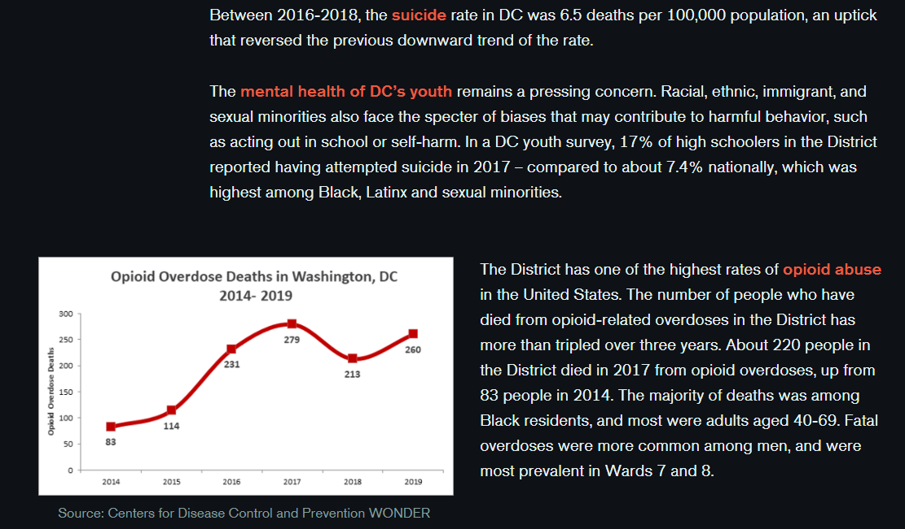
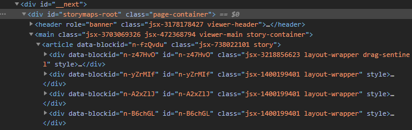
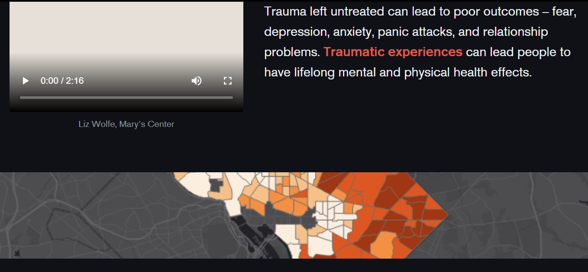
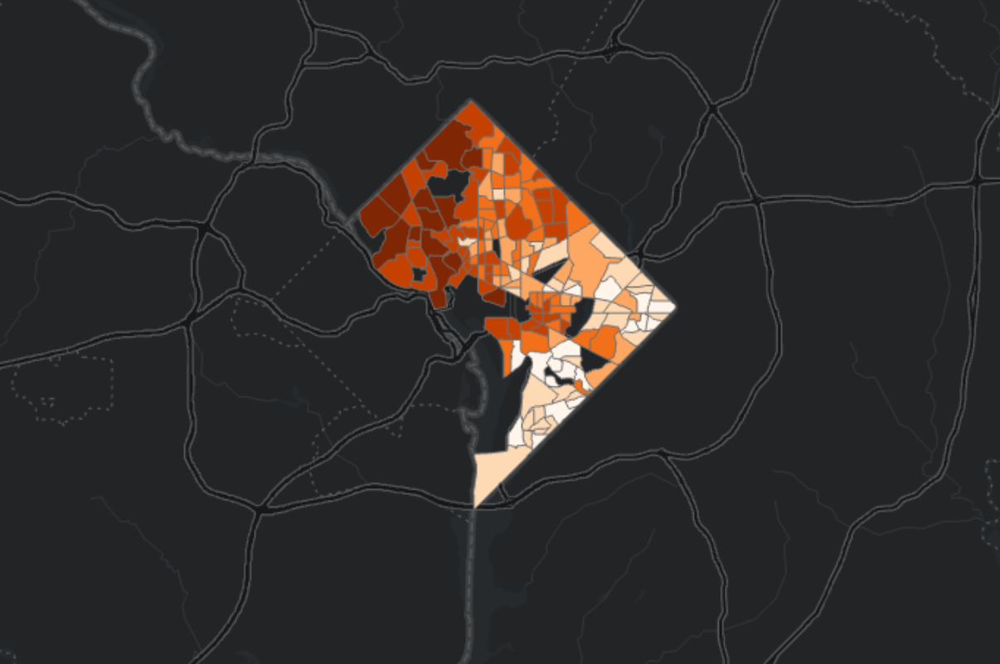
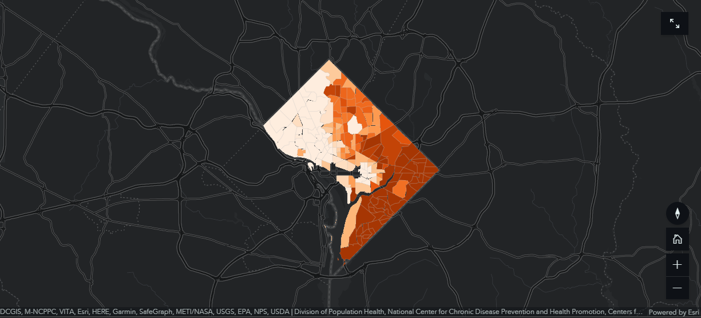
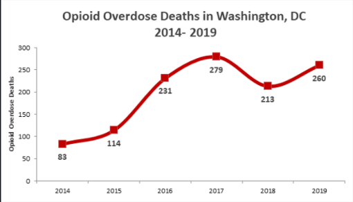
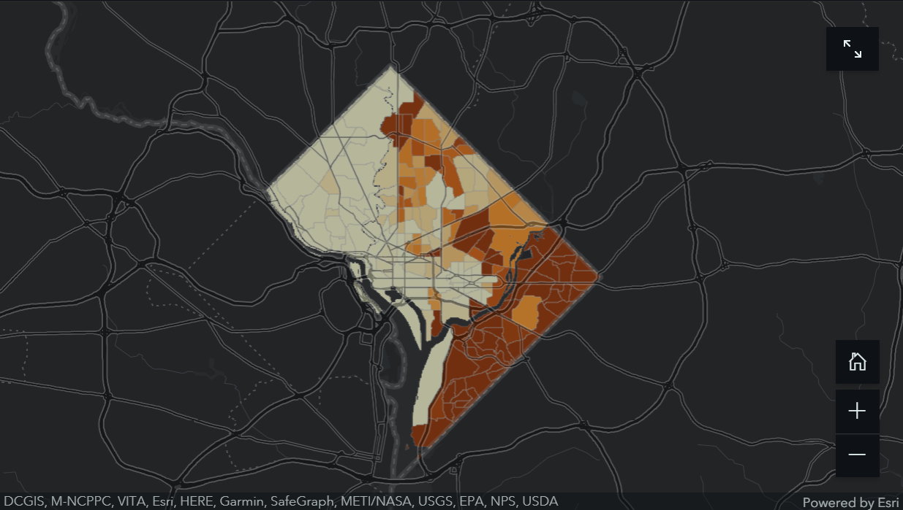
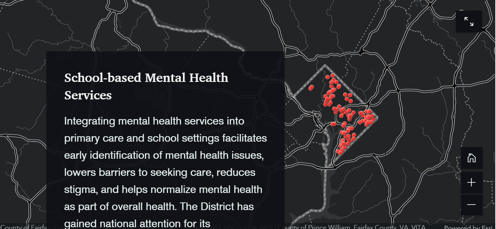
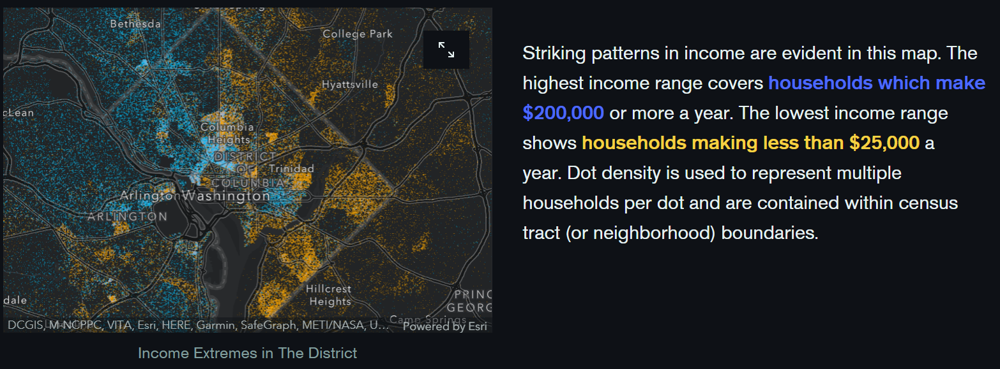

# Don’t Cut DC’s Lifeline to Mental Health - Review

*By Jerome Orille | 3/12/2021 | GEOG 458*

[Link to the project](https://storymaps.arcgis.com/stories/dc3529cc90394d93974744a067fce81f)

## Introduction

My favorite memories of my childhood include experiencing life with my brother and friends. My brother, friends and
I would always go outside to play football, then go back to indulge in video games and spend the rest of our night
arguing over who would win. These little experiences taught me the value of family and friends. Fast forward to today,
and those experiences are long gone. My friends all moved out going down their own separate paths. But worst of all,
my brother was recently diagnosed with ADHD. He is suffering from this condition and is having trouble studying and
focusing, which causes him to lose his appetite and struggle with daily activities in life. I cannot bear to see
someone so important to me being consumed by a mental health condition.

The project I am reviewing is an article called **Don’t Cut DC’S Lifeline to Mental Health**, by the District of
Columbia Health Matters Collaborative. My short anecdote proves the importance of mental health and how I believe
it needs to be addressed in many other projects. According to the project, the DC Health Matters Collaborative was
created in 2012, and houses hospitals in the District of Columbia. The project was created to **advocate for avoiding**
**cuts to the budgets of various healthcare providers in Washington DC**. There is also a need to **prioritize the mental**
**health of the residents of DC**. The goal of this project is to create a call to action and give equitable access to
mental health. The intended audience appears to be pointed toward healthcare authorities and the higher-ups of Washington
DC, because of the call to action provided in the project. The project is very educational as well, so anyone who wants
to learn more about mental health in Washington DC would benefit from this project as well.

## Project Features and Elements

The project is ultimately an **ArcGIS Storymap** that is accessed by scrolling down an HTML page. The page contains text,
images, videos and ESRI maps. The images are graphs and maps that are shown on the page. The text describes the goal
of the project, the research done and what data was collected. The videos give an understanding of the problem of
mental health and why mental health needs more resources. The webpage uses many javascript functions. Javascript
functions are mainly used to present the elements on the page one by one. They are also used for showing tilesets of ESRI maps.

The web maps in the webpage usually only have two web map elements, which are sources and data points. Figure 5 shows an
additional element, which is a north arrow. The creators of the web maps are not using all of the cartographic elements,
which gives me a limited view of the maps they present. It would especially help to have a legend, because the variables
being measured may not be easy to understand if one just looks at the maps.

I also examined the metadata of the project. The author of the project was the **District of Columbia Health Matters**
**Collaborative**. I scoured the web for sources pertaining to this organization, and [found this website](https://www.dchealthmatters.org/).
Based on the information presented on the website, the organization seems to be trustworthy and benevolent,
showing care toward their works and staying true to their beliefs. The data sources used in the project are as follows:
- [Centers for Disease Control and Prevention WONDER](https://wonder.cdc.gov/)
- [Division of Population Health](https://www.cdc.gov/populationhealth/index.html)
- [National Center for Chronic Disease and Prevention](https://www.cdc.gov/chronicdisease/index.htm)

These are reputable sources because they are all from the **Centers for Disease Control and Prevention**.
The study was conducted in 2019, which assumes that the data started being collected in that year or even before.

## System Architecture

The project mainly utilizes **HTML, CSS and javascript** to present the information. HTML encompasses the entirety of the
project, as the webpage is built with HTML. CSS is used to stylize the elements further by introducing elements such
as text blocks, differing text colors and differing margins (see Figure 1). Javascript functions are used in a variety
of ways in the webpage, such as loading in tilesets.

Since the project is intended as a presentation to show a cause, the clients are the end users who read the information.
The server is stored on storymaps.arcgis.com as an ArcGIS Storymap, as the website is hosting the created Storymap.
The services used include various ESRI javascript functions, tilesets and Storymap functions used to create the webpage.
These javascript functions are mainly the data flowing in and out via requests; as the user scrolls down the page, more
requests will be made and more data will flow in. The data comes from ArcGIS, which includes basemaps, widgets and tilesets.

In the source code, there are many div tags (see Figure 2). An important tag is the ID “storymaps-root” which contains the
entire body of the Storymap. Removing this would cause the Storymap to disappear. The ID “next” contains the ID “storymaps-root”,
yet I am not sure what it is used for. I would assume that there are different CSS stylizations. Many div tags were created
below the ID “storymaps-root”, which seem to be various tilesets of the maps.

*Figure 1: Example of CSS Margin Formatting*

*Figure 2: Source Code*

## User Interface and Web Mapping Design

The first thing that comes to mind when examining the user interface is the **responsive design**. The applications should usually
be readily accessed by many different applications and technologies. I would include screen size as well, although it is a little
harder to compensate for different monitor sizes. I have two monitors, one with a smaller screen and a bigger screen. I noticed
that some maps and images do not fit well in my second monitor (see Figure 3), while other elements of the webpage fit relatively
well in my second monitor. The responsive design could be improved by fitting the elements to all screen sizes, though this would
be difficult due to the limitations of CSS.

*Figure 3: Sample of Elements, Responsive Design*

Despite the project showing many maps, there are only **three embedded web maps**. I thought this was a weird design, because I
would expect the project to be full of either pictures of web maps, or embedded web maps, not a mix of pictures and embedded web
maps. These have the dark grey basemap, which is a default basemap in ArcGIS and other ESRI programs. The thematic layers consist
of polygons that represent DC neighborhoods and data points representing schools in DC. Some interactive features of the web maps
include zoom, full screen and a return to home button. There are a total of six visualizations, which include five maps and one graph.

## Analysis of Data Visualizations

### Life Expectancy by Neighborhood

*Figure 4: Life Expectancy by Neighborhood, Washington DC*

Figure 4 shows the **life expectancy by neighborhood**. Just looking at this image may induce confusion, as there is not a legend to
distinguish the values of the variables. The lighter the color, the less life expectancy the average adult has in each neighborhood.
The map presents the southeastern side as having a lower life expectancy than the northern parts of Washington DC. I have some additional
issues with the map:
- I would prefer darker areas to be areas that are in need of change. I would have expected a darker color to represent lower life expectancy
- The quality of the image is low, which means that the creators should have used higher DPI resolutions when exporting their maps as images.

### Percentage of Adults with Poor Mental Health by Neighborhood

*Figure 5: Poor Mental Health in Neighborhoods, Washington DC*

Figure 5 is very similar to Figure 4, except that Figure 5 is an **embedded web map**. There are interactive features added in.
These features include a north arrow, home button, zoom levels and full screen. The darker color indicates a higher percentage of
adults that have poor mental health in a neighborhood. Much like Figure 4, Figure 5 shows how the neighborhoods in the southeast
have higher percentages of adults that have poor mental health than the neighborhoods in the northwest. However, legends would be
helpful in distinguishing values.

### Opioid Overdose Deaths in Washington DC

*Figure 6: Opioid Overdose deaths in Washington DC, 2014 - 2019*

This visualization is the **only graph** in the project. This graph shows the opioid overdose deaths in Washington DC during the
years 2014 and 2019. As the years go by, the number of opioid overdose deaths increase, indicating a positive association between
the variables. A problem with this graph is that the graph might have a context trap. A context trap is described by
[Shapiro](https://hbr.org/2017/01/3-ways-data-dashboards-can-mislead-you#comment-section) as “[equating] ‘empirical’ and
‘quantitative’ with ‘objective.’” This means that people tend to act on ideas presented on a dashboard without thinking,
because they are real statistics. However, the graph displaying opioid deaths shows only reported statistics. What if there are other
deaths that go unreported? This could be applied to any data in general; data is finicky and might contain truths that might necessarily not be truths.

### Medicaid Beneficiaries in Washington DC

*Figure 7: Medicaid Beneficiaries in Washington DC*

Figure 7 showed **Medicaid beneficiaries in Washington DC**. I felt like this visualization was very ambiguous despite being a clear web map.
This was because I did not understand if the darker areas meant that there were more or less Medicaid beneficiaries. This was unclear in the
text as well. I interpreted the areas as having more beneficiaries, which meant that even though there were more areas of insurance in the
southeastern region of Washington DC, the area was still plagued by a lower life expectancy and poorer mental health. I thought this was
interesting because I would expect to see the opposite, which would be higher life expectancy and greater mental health quality.

### School-Based Mental Health Services

*Figure 8: School-Based Mental Health Services*

Figure 8 is an embedded web map that shows **school-based mental health services**. This is the only web map that is in the background against the text.
This is strange for the design, because this is the only web map with that feature. Regardless, the embedded web map contains interactive elements
such as a home button, zoom levels and full screen mode. The red dots are unclear as well; do they represent schools, or schools with mental health programs?

### Income Extremes By Household in Washington, DC

*Figure 9: Income Extremes By Household in Washington, DC*

Figure 9 is another embedded web map showing **income extremes by household in Washington DC**. This web map felt more clear than the rest, mainly
because the authors decided to uniquely reference what each color represented in the text. I thought that was very interesting how they highlighted
the text “households which make $200,000” in blue, and “households making less than $25,000” in yellow. This allows one to easily distinguish what
the colors meant in the embedded web map. It would still be helpful to have a legend, but the pressure of understanding the variables is lower
regarding this web map.

## Pros/Cons

I would say that many of the pros stem from the results and discussion described in the text. More importantly, it was really easy to **synthesize**
**the arguments of the text because of creative highlighting of important terms**. This can be seen in Figure 1, Figure 3 and Figure 9, where the
highlighted terms are often the central topic of the paragraph or data visualizations. The project also had **many statistics to back up claims**;
this was mainly seen in data visualizations, such as the graph shown in Figure 6. This was all backed up by the **great discussion of socioeconomic**
**implications with mental health**. The project goes through death rates, depression rates, how mental health impacts high schoolers, etc. in great depth.

The design aspect of the project was the weakest link to me. For example, **the images often had poor quality**. Figure 4 was very pixelated in the web
browser. In addition, the **map visualizations were confusing because they had few cartographic elements**. The most important parts are the title and
legend, which give context to the variables being shown. However, they were not shown at all in the project. Finally, the **responsive design could be improved**,
though many elements scaled well in both of my monitors.

To sum up:

*Pros*
- Highlighting of important terms to easily synthesize arguments of the text
- Statistics to back up claims
- Great discussion of socioeconomic implications regarding mental health in Washington DC

*Cons*
- Images often have poor quality
- Map visualizations having few cartographic elements makes them confusing
- Responsive design could be improved

## Reflection

This project by the District of Columbia Health Matters Collaborative encompasses social justice values of equity by detailing the need for mental health
access for residents in Washington DC. I thought about many concepts from this project that I would have not thought of before and it taught me a great
deal about the data I encounter in the world. For example, I learned about behavioral health, which is the emotional and mental health that optionally
pertains to substance use and addiction as well. Many of the residents of Washington DC suffered from low behavioral health because of opioid abuse. I
also learned much about the issues of equity in DC with regards to mental health, and how action must be taken to support those in need.

The project also made me think of the various GIS techniques I learned over the past year. I learned why cartographic elements are important and how
they provide context to variables, something I never really understood until I reviewed this project. Even though the design of the maps were not
fully built out, they still give a good amount of information to someone learning about mental health in Washington DC. The GIS techniques shown in
the project is proof how technology can be used as an advocate for change in residential areas. This is shown in
[the article by Mattern](https://placesjournal.org/article/a-city-is-not-a-computer/?cn-reloaded=1#0), where she suggests how “Alphabet… is moving
forward with plans to build its own optimized cities.” Though this example is much different in that the technology is directly changing the city
rather than being evidence for a cause, they both have similar attempts to reform society in some way.

Lastly, I appreciate the effort that this organization put into this project. I believe projects like these would teach people how to take mental
health seriously and what steps to take in taking care of their loved ones.

## Works Cited

Shapiro, J. (2017). 3 Ways Data Dashboards Can Mislead You. Retrieved from https://hbr.org/2017/01/3-ways-data-dashboards-can-mislead-you

Mattern, S. (2017). A City Is Not a Computer. Retrieved from https://placesjournal.org/article/a-city-is-not-a-computer/?cn-reloaded=1#0 